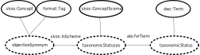

# Vocabulary Plugin

This plugin allows applications to display terms from controlled vocabularies in ways
that allow links to more information about the term.
It also allows language markers to be displayed in a similar fashion.

Backing the plugin is a *vocabulary service* that provides semantic information about
terms in JSON-LD (JSON Linked-Data) format and a *vocabulary server* that displays
the semantic information in a nice, human-readable form.
The vocabulary service also provides CSS and JavaScript resources that can be
embedded into a page and controls term display.

The upshot of all of this is that terms from specialised vocabularies can be
turned into linked tags with rich information about what the term means and its relationship
to other terms and vocabularies.

* [Vocabulary Service](https://github.com/AtlasOfLivingAustralia/vocabulary-service)
* [Vocabulary Server](https://github.com/AtlasOfLivingAustralia/vocabulary-server-plugin)


## Use

### Installation

Add the following dependency to `build.gradle`

```
    compile "au.org.ala.grails.plugin.vocabulary-plugin"
```

### Configuration

The plugin requires the base urls of to the vocabulary service and server 
to be configured in `application.yml`

```$xslt
vocabulary:
  server: https://vocabulary.ala.org.au
  service: https://vocabulary.ala.org.au/ws
```

### Vocabulary Tag Library

The tag library has the `voc` prefix.

In this section, IRIs (Internationalized Resource Identifier, an extension of URI)
that denote RDF properties or classes are usually given in short *prefix:label* form,
eg `skos:Concept` rather than as the full `http://www.w3.org/2004/02/skos/core#Concept`


#### tagHeader

Include `<voc:tagHeader/>` in the head of any page that will use `voc:tag`, 
`voc:language` or `voc:term` tags.
This tag imports appropriate style sheets and gets summary information and styles for
terms.

#### concept

This tags a term as a vocabulary element with
`<voc:concept iri="iri" vocabulary="vocab" concept="term" style='tag'/>`.
The corresponding term supplied by the service should have an RDF class or subclass of 
`format:Tag`, along with any other classes that describe the resource.
The term and vocabulary are preferentially drawn from the `skos:notation`
property; see the service documentation for more details.
There are three ways of using this tag:

* **iri** only. The IRI of the term, eg, `http://www.ala.org.au/terms/1.0/taxonomicStatus/accepted`
* **concept** only. If the term is unique across all vocabularies, eg `TK NV` then
  only the term need be supplied. This form is useful for informally defined
  labels and tags but may run into problems if there is a collision in
  vocabularies.
* **vocabulary** and **concept**. The term is picked from a specific controlled vocabulary.
  The vocabulary is a `skos:ConceptScheme` and is labelled either by the 
  `skos:notation`, `skos:prefLabel` or `rdfs:label` properties.
  As an example, a pair might be `tkLabels/TK NV`
  As an alternative, the vocabulary may be a Darwin Core term, such as `taxonomicStatus`
  that the vocabulary is linked to by a `ala:forTerm` property, for example
  `nomenclaturalCode/ICZN`
  The relationship between the term, the scheme and the Darwin Core term is shown
  below.
  


The **style** attribute can be either an iri or `concept`, `language` or `term`, corresponding to
the `format:Concept`, `format:Language` or `format:Term` classes.
If empty, the type is assumed to be a tag until it is replaced by the appropriate styling.


### format

Display a resource or value from [JSON-LD](#json-ld) data.
The resource is usually displayed as label or title but can have display
forms configured by the style attribute.
`<voc:format value="${resource}" class="rdf-resource" style="image" property="format:icon" context="${context}"/>`

The parameters are as follows:

* **value** (required) The value to format.
* **class** A CSS class to use when displaying the value. Defaults to `rdf-resource`.
* **style** How to display the value. The style attribute can have the following values:
  * *label* Choose the supplied label, which is usually the `skos:prefLabel` or `rdfs:label`, if not that then use the shortId or the @id
  * *id* Choose the supplied shortId, which is a namespaced identifier or the @id
  * *title* Choose the supplied title, followed by the label, shortId and @id
  * *long* Always show the long @id
  * *image* Display an image as an full-size image
  * *thumbnail* Display an image as a thumbnail with a link to the full size image
  * *icon* Display an image as a small icon
* **property** The name of a property that can be used to gather style information
  via the `format:style` annotation of that property.
* **context** The JSON-LD @context of the value. If absent, a `pageScope.context` variable
  is used.
* **language** If true literals with a language are language-tagged

### label

Display a label for a [JSON-LD](#json-ld) resource or value.
`<voc:label value="${resource}" style="image" context="${context}"/>`
See [voc:format](#format) for an explanation of the parameters.

  
### isTag

Includes the body if a particular resource is a tagged resource, capable of being displayed
by the `voc:tag` tag.
`<voc:isTag value="${resource}" context="${context}" style="language">This is a tag</voc:isTag>`
The attributes are:

* **value** (required) The resource (as JSON-LD) to be tested.
* **context** (optional, defaults to pageContext.context) The JSON-LD context
* **style** (optional) Either an IRI or one of `tag`, `language` or `term`, corresponding to
  the `format:Tag`, 'format:Language` or `format:Term` classes. If absent, any tag class is acceptable.


## Additional Information

### JSON LD

The vocabulary service uses an extended form of [JSON-LD]() to describe resources.

In JSON-LD, the `@context` contains explanatory information about namespaces
and what particular terms mean.
In the case of the tags that display JSON-LD, the `@context` is often provided
as part of the model as a `context` variable.
If not specified in the tag, the tag will see if there is a `pageScope.context` available
and use that as the context.

The JSON-LD returned by the vocabulary service has an number of addtional @-attributes
that can be used to ease formatting and display.
See the [vocabulary service documentation](https://github.com/AtlasOfLivingAustralia/vocabulary-service/README.md)
for more information.
